## 第一章  设计模式概述 

总体来说设计模式分为三大类：
**创建型模式**，共五种：工厂方法模式、抽象工厂模式、单例模式、建造者模式、原型模式。
**结构型模式**， 共七种：适配器模式、装饰器模式、代理模式、外观模式、桥接模式、组合模式、享元模式。
**行为型模式**， 共十一种：策略模式、模板方法模式、观察者模式、迭代子模式、责任链模式、命令模式、备忘录模式、状态模式、访问者模式、中介者模式、解释器模式。 

### 1 创建型模式 

1、 Singleton，单例模式：保证一个类只有一个实例，并提供一个访问它的全局访问点。
2、 Abstract Factory，抽象工厂：提供一个创建一系列相关或相互依赖对象的接口，而无须指定它们的具体类。
3、 Factory Method，工厂方法：定义一个用于创建对象的接口，让子类决定实例化哪一个类， Factory Method 使一个类的实例化延迟到了子类。
4、 Builder，建造模式：将一个复杂对象的构建与他的表示相分离，使得同样的构建过程可以创建不同的表示。
5、 Prototype，原型模式：用原型实例指定创建对象的种类，并且通过拷贝这些原型来创建新的对象。 

### 2 行为型模式

1、 Iterator，迭代器模式：提供一个方法顺序访问一个聚合对象的各个元素，而又不需要暴露该对象的内部表示。
2、 Observer，观察者模式：定义对象间一对多的依赖关系，当一个对象的状态发生改变时，所有依赖于它的对象都得到通知自动更新。
3、 Template Method，模板方法：定义一个操作中的算法的骨架，而将一些步骤延迟到子类中， TemplateMethod 使得子类可以不改变一个算法的结构即可以重定义该算法得某些特定步骤。
4、 Command，命令模式：将一个请求封装为一个对象，从而使你可以用不同的请求对客户进行参数化，对请求排队和记录请求日志，以及支持可撤销的操作。
5、 State，状态模式：允许对象在其内部状态改变时改变他的行为。对象看起来似乎改变了他的类。
6、 Strategy，策略模式：定义一系列的算法，把他们一个个封装起来，并使他们可以互相替换，本模式使得算法可以独立于使用它们的客户。
7、 China of Responsibility，职责链模式：使多个对象都有机会处理请求，从而避免请求的送发者和接收者之间的耦合关系
8、 Mediator，中介者模式：用一个中介对象封装一些列的对象交互。
9、 Visitor，访问者模式：表示一个作用于某对象结构中的各元素的操作，它使你可以在不改变各元素类的前提下定义作用于这个元素的新操作。
10、 Interpreter，解释器模式：给定一个语言，定义他的文法的一个表示，并定义一个解释器，这个解释器使用该表示来解释语言中的句子。
11、 Memento，备忘录模式：在不破坏对象的前提下，捕获一个对象的内部状态，并在该对象之外保存这个状态。 

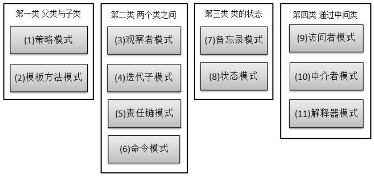

### 3 结构型模式

1、Composite，组合模式：将对象组合成树形结构以表示部分整体的关系， Composite使得用户对单个对象和组合对象的使用具有一致性。
2、 Facade，外观模式：为子系统中的一组接口提供一致的界面， fa?ade 提供了一高层接口，这个接口使得子系统更容易使用。
3、 Proxy，代理模式：为其他对象提供一种代理以控制对这个对象的访问。
4、 Adapter,适配器模式：将一类的接口转换成客户希望的另外一个接口， Adapter模式使得原本由于接口不兼容而不能一起工作那些类可以一起工作。
5、 Decrator，装饰模式：动态地给一个对象增加一些额外的职责，就增加的功能来说， Decorator 模式相比生成子类更加灵活。
6、 Bridge，桥模式：将抽象部分与它的实现部分相分离，使他们可以独立的变化。
7、 Flyweight，享元模式 

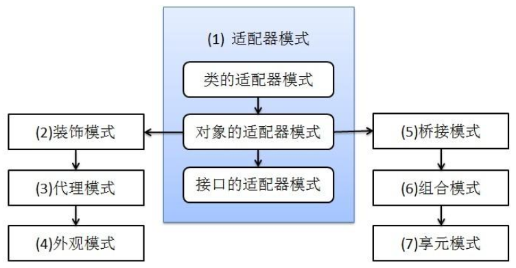

### 4 设计模式之间的关系

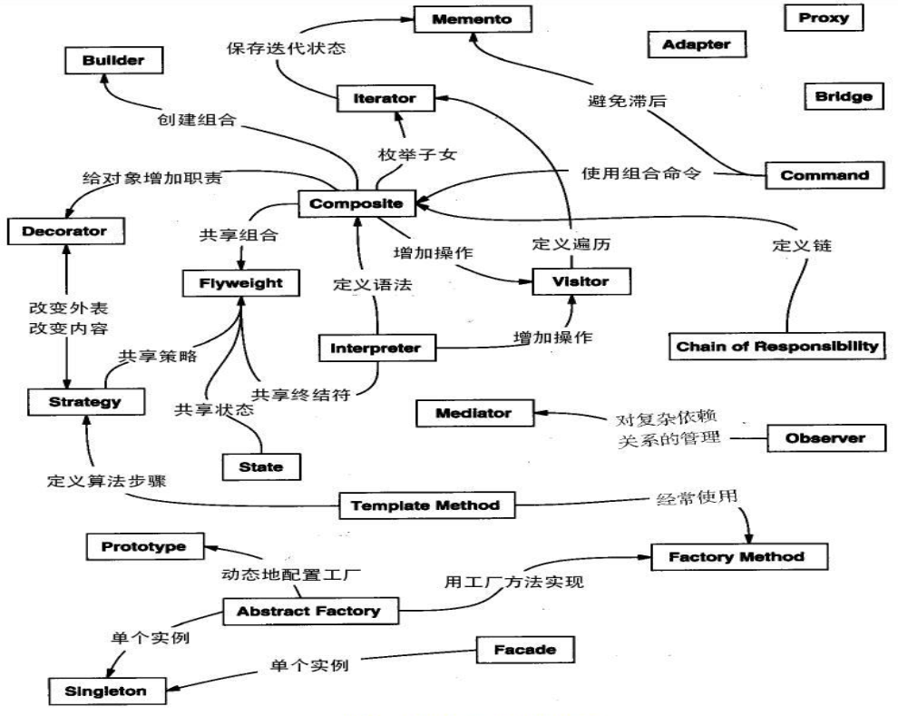


## 第二章  设计模式的六大原则 

### 1 总原则：开放封闭原则

开闭原则就是说**对扩展开放，对修改关闭**。在程序需要进行拓展的时候，不能去修改原有的代码，而是
要扩展原有代码，实现一个热插拔的效果。所以一句话概括就是：为了使程序的扩展性好， 易于维护和
升级。想要达到这样的效果，我们需要使用接口和抽象类等 。

#### 1.1 概念

开放封闭原则(Open-Closed Principle)：一个软件实体应当对扩展开放，则修改关闭。

在设计一个模块时，应当使得这个模块可以在不被修改的前提下被扩展。也就是说，应当可以在不必修改源代码的情况下修改这个模块的行为。

设计的目的便在于面对需求的改变而保持系统的相对稳定，从而使得系统可以很容易的从一个版本升级到另一个版本。

#### 1.2 怎样做到开放封闭原则

实际上，绝对封闭的系统是不存在的。无论模块是怎么封闭，到最后，总还是有一些无法封闭的变化。而我们的思路就是：既然不能做到完全封闭，那我们就应该对那些变化封闭，那些变化隔离做出选择。我们做出选择，然后将那些无法封闭的变化抽象出来，进行隔离，允许扩展，尽可能的减少系统的开发。当系统变化来临时，我们要及时的做出反应。

我们并不害怕改变的到来。当变化到来时，我们首先需要做的不是修改代码，而是尽可能的将变化抽象出来进行隔离，然后进行扩展。面对需求的变化，对程序的修改应该是尽可能通过添加代码来实现，而不是通过修改代码来实现。

实际上，变化或者可能的变化来的越早，抽象就越容易，相对的，代码的维护也就越容易；而当项目接近于完成而来的需求变化，则会使抽象变得很困难——这个困难，并不是抽象本身的困难，抽象本身并没有困难，困难在于系统的架构已经完成，修改牵扯的方面太多而使得抽象工作变得很困难。

繁忙的银行业务员


轻松的银行业务员


#### 1.3 优越性

1.通过扩展已有的软件系统，可以提供新的行为，以满足对软件的新需求，是变化中的软件有一定的适应性和灵活性。

2.已有的软件模块，特别是最重要的抽象模块不能再修改，这就使变化中的软件系统有一定的稳定性和延续性。

### 2 单一职责原则

#### 2.1 概念

单一职责原则(Single Responsibility Principle )：就一个类而言，应该仅有一个引起它变化的原因。不要存在多于一个导致类变更的原因，也就是说每个类应该实现单一的职责，如若不然，就应该把类拆分。 

#### 2.2 示例

接受客户端输入并提交到数据库。

原有设计：

​    一个类负责接受客户端输入，对客户端输入进行校验，连接数据库，并提交数据到数据库。

现有设计：

​    一个功能也就是一个职责由一个类来负责。

### 3 里氏代换原则

#### 3.1 概念

里氏代换原则(Liskov Substitution Principle LSP)面向对象设计的基本原则之一。 里氏代换原则中说，任何基类可以出现的地方，子类一定可以出现。 LSP 是继承复用的基石，只有当衍生类可以替换掉基类，软件单位的功能不受到影响时，基类才能真正被复用，而衍生类也能够在基类的基础上增加新的行为。里氏代换原则是对“开-闭”原则的补充。实现“开-闭”原则的关键步骤就是抽象化。而基类与子类的继承关系就是抽象化的具体实现，所以里氏代换原则是对实现抽象化的具体步骤的规范。—— From Baidu百科
历史替换原则中，子类对父类的方法尽量不要重写和重载。因为父类代表了定义好的结构，通过这个规
范的接口与外界交互，子类不应该随便破坏它。 
一个软件实体如果使用的是一个父类的话，那么一定适用于其子类，而且它察觉不出父类和子类对象的区别。也就是说，在软件里面，把父类替换成它的子类，程序的行为没有变化。

### 4 依赖倒转原则

#### 4.1 倒转概念


传统的过程式设计倾向于使高层次的模块依赖于低层次的模块，抽象层依赖于具体的层次。


#### 4.2 依赖倒转原则概念

依赖倒转(Dependence Inversion Principle )：

这个是开闭原则的基础，具体内容：面向接口编程，依赖于抽象而不依赖于具体。写代码时用到具体类
时，不与具体类交互，而与具体类的上层接口交互。 

​    1.抽象不应该依赖于细节，细节应该依赖于抽象。

​    2.高层模块不依赖底层模块，两者都依赖抽象。

#### 4.3 怎么做到依赖倒转

1.工厂方法模式

2.模板方法模式

3.迭代子模式 

### 5 迪米特法则

#### 5.1 概念

迪米特法则(Law of Demeter )又叫做最少知识原则，也就是说，一个对象应当对其他对象尽可能少的了解。

迪米特法则最初是用来作为面向对象的系统设计风格的一种法则，于1987年秋天由lan holland在美国东北大学为一个叫做迪米特的项目设计提出的。

狭义的迪米特法则：如果两个类不必彼此直接通信，那么这两个类就不应当发生直接的相互作用。如果其中一个类需要调用另一类的某一个方法的话，可以通过第三者转发这个调用。

一个类对自己依赖的类知道的越少越好。也就是说无论被依赖的类多么复杂，都应该将逻辑封装在方法的内部，通过 public 方法提供给外部。这样当被依赖的类变化时，才能最小的影响该类。最少知道原则的另一个表达方式是：只与直接的朋友通信。类之间只要有耦合关系，就叫朋友关系。耦合分为依赖、关联、聚合、组合等。我们称出现为成员变量、方法参数、方法返回值中的类为直接朋友。局部变量、临时变量则不是直接的朋友。我们要求陌生的类不要作为局部变量出现在类中。 

#### 5.2 设计模式

1.外观模式

2.中介者模式

### 6 接口隔离原则 

每个接口中不存在子类用不到却必须实现的方法，如果不然，就要将接口拆分。使用多个隔离的接口，比使用单个接口（多个接口方法集合到一个的接口）要好。 

### 7 合成复用原则 

尽量首先使用合成/聚合的方式， 而不是使用继承。 


## 第三章  Java的24种设计模式

### 1   简单工厂模式

#### 1.1 概念

简单工厂模式属于类的创建型模式,又叫做静态工厂方法模式。通过专门定义一个类来负责创建其他类的实例，被创建的实例通常都具有共同的父类。

#### 1.2 分类

简单工厂模式模式分为三种： 

1.普通

就是建立一个工厂类，对实现了同一接口的一些类进行实例的创建。首先看下关系图： 

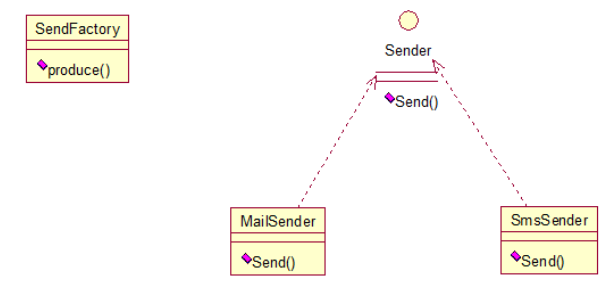

2.多个方法

是对普通工厂方法模式的改进，在普通工厂方法模式中，如果传递的字符串出错，则不能正确创建对象，而多个工厂方法模式是提供多个工厂方法，分别创建对象。关系图： 


3.多个静态方法 

将上面的多个工厂方法模式里的方法置为静态的，不需要创建实例，直接调用即可。 

总体来说，工厂模式适合：凡是出现了大量的产品需要创建，并且具有共同的接口时，可以通过工厂方法模式进行创建。在以上的三种模式中，第一种如果传入的字符串有误，不能正确创建对象，第三种相对于第二种，不需要实例化工厂类，所以，大多数情况下，我们会选用第三种——静态工厂方法模式。 

#### 1.3 模式中的角色和职责

1.工厂（Creator）角色
 简单工厂模式的核心，它负责实现创建所有实例的内部逻辑。工厂类可以被外界直接调用，创建所需的产品对象。

2.抽象（Product）角色
 简单工厂模式所创建的所有对象的父类，它负责描述所有实例所共有的公共接口。

3.具体产品（Concrete Product）角色
 简单工厂模式所创建的具体实例对象

#### 1.4 优缺点

在这个模式中，工厂类是整个模式的关键所在。它包含必要的判断逻辑，能够根据外界给定的信息，决定究竟应该创建哪个具体类的对象。用户在使用时可以直接根据工厂类去创建所需的实例，而无需了解这些对象是如何创建以及如何组织的。有利于整个软件体系结构的优化。

不难发现，简单工厂模式的缺点也正体现在其工厂类上，由于工厂类集中了所有实例的创建逻辑，所以“高内聚”方面做的并不好。另外，当系统中的具体产品类不断增多时，可能会出现要求工厂类也要做相应的修改，扩展性并不很好。 

### 2   工厂方法模式

#### 2.1 概念

简单工厂模式有一个问题就是，类的创建依赖工厂类，也就是说，如果想要拓展程序，必须对工厂类进行修改，这违背了闭包原则，所以，从设计角度考虑，有一定的问题，如何解决？就用到工厂方法模式，创建一个工厂接口和创建多个工厂实现类，这样一旦需要增加新的功能，直接增加新的工厂类就可以了，不需要修改之前的代码。 

工厂方法模式同样属于类的创建型模式又被称为多态工厂模式 。工厂方法模式的意义是定义一个创建产品对象的工厂接口，将实际创建工作推迟到子类当中。核心工厂类不再负责产品的创建，这样核心类成为一个抽象工厂角色，仅负责具体工厂子类必须实现的接口，这样进一步抽象化的好处是使得工厂方法模式可以使系统在不修改具体工厂角色的情况下引进新的产品。

#### 2.2 结构

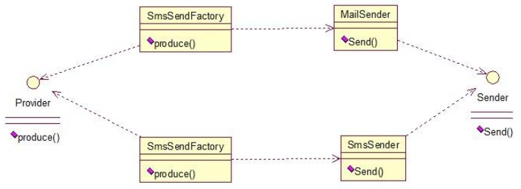

#### 2.3 模式中的角色和职责

1.抽象工厂（Creator）角色
 工厂方法模式的核心，任何工厂类都必须实现这个接口。

2.具体工厂（ Concrete  Creator）角色
 具体工厂类是抽象工厂的一个实现，负责实例化产品对象。

3.抽象（Product）角色
 工厂方法模式所创建的所有对象的父类，它负责描述所有实例所共有的公共接口。

4.具体产品（Concrete Product）角色
 工厂方法模式所创建的具体实例对象。

#### 2.4 工厂方法模式和简单工厂模式比较

工厂方法模式与简单工厂模式在结构上的不同不是很明显。工厂方法类的核心是一个抽象工厂类，而简单工厂模式把核心放在一个具体类上。  

工厂方法模式之所以有一个别名叫多态性工厂模式是因为具体工厂类都有共同的接口，或者有共同的抽象父类。

当系统扩展需要添加新的产品对象时，仅仅需要添加一个具体对象以及一个具体工厂对象，原有工厂对象不需要进行任何修改，也不需要修改客户端，很好的符合了“开放－封闭”原则。而简单工厂模式在添加新产品对象后不得不修改工厂方法，扩展性不好。

工厂方法模式退化后可以演变成简单工厂模式。 

### 3 抽象工厂模式

#### 3.1 概念

抽象工厂模式是所有形态的工厂模式中最为抽象和最其一般性的。抽象工厂模式可以向客户端提供一个接口，使得客户端在不必指定产品的具体类型的情况下，能够创建多个产品族的产品对象。

#### 3.2 模式中的角色和职责

1.抽象工厂（Creator）角色
 抽象工厂模式的核心，包含对多个产品结构的声明，任何工厂类都必须实现这个接口。

2.具体工厂（ Concrete  Creator）角色
 具体工厂类是抽象工厂的一个实现，负责实例化某个产品族中的产品对象。

3.抽象（Product）角色
 抽象模式所创建的所有对象的父类，它负责描述所有实例所共有的公共接口。

4.具体产品（Concrete Product）角色
 抽象模式所创建的具体实例对象

总结：抽象工厂中方法对应产品结构，具体工厂对应产品族。

#### 3.3 工厂方法模式和抽象工厂模式的区别 

工厂方法模式：
一个抽象产品类，可以派生出多个具体产品类。 
一个抽象工厂类，可以派生出多个具体工厂类。
每个具体工厂类只能创建一个具体产品类的实例。
抽象工厂模式：
多个抽象产品类，每个抽象产品类可以派生出多个具体产品类。
一个抽象工厂类，可以派生出多个具体工厂类。
每个具体工厂类可以创建多个具体产品类的实例，也就是创建的是一个产品线下的多个产品。
区别：
工厂方法模式只有一个抽象产品类，而抽象工厂模式有多个。
工厂方法模式的具体工厂类只能创建一个具体产品类的实例，而抽象工厂模式可以创建多个。
工厂方法创建 "一种" 产品，他的着重点在于"怎么创建"，也就是说如果你开发，你的大量代码很可能
围绕着这种产品的构造，初始化这些细节上面。也因为如此，类似的产品之间有很多可以复用的特征，
所以会和模版方法相随。
抽象工厂需要创建一些列产品，着重点在于"创建哪些"产品上，也就是说，如果你开发，你的主要任务
是划分不同差异的产品线，并且尽量保持每条产品线接口一致，从而可以从同一个抽象工厂继承。
对于 java 来说，你能见到的大部分抽象工厂模式都是这样的：
---它的里面是一堆工厂方法，每个工厂方法返回某种类型的对象。
比如说工厂可以生产鼠标和键盘。那么抽象工厂的实现类（它的某个具体子类）的对象都可以生产鼠标
和键盘，但可能工厂 A 生产的是罗技的键盘和鼠标，工厂 B 是微软的。
这样 A 和 B 就是工厂，对应于抽象工厂；
每个工厂生产的鼠标和键盘就是产品，对应于工厂方法； 
用了工厂方法模式，你替换生成键盘的工厂方法，就可以把键盘从罗技换到微软。但是用了抽象工厂模式，你只要换家工厂，就可以同时替换鼠标和键盘一套。如果你要的产品有几十个，当然用抽象工厂模式一次替换全部最方便（这个工厂会替你用相应的工厂方法）。
所以说抽象工厂就像工厂，而工厂方法则像是工厂的一种产品生产线 。

### 4 单例模式

#### 4.1 概念

单例模式是一种对象创建型模式，使用单例模式，可以保证为一个类只生成唯一的实例对象。也就是说，在整个程序空间中，该类只存在一个实例对象。

其实，GoF对单例模式的定义是：保证一个类、只有一个实例存在，同时提供能对该实例加以访问的全局访问方法。 

在应用系统开发中，我们常常有以下需求：

\- 在多个线程之间，比如servlet环境，共享同一个资源或者操作同一个对象

\- 在整个程序空间使用全局变量，共享资源

\- 大规模系统中，为了性能的考虑，需要节省对象的创建时间等等。

因为Singleton模式可以保证为一个类只生成唯一的实例对象，所以这些情况，Singleton模式就派上用场了。

#### 4.2 单例模式实现

1.饿汉式。

2.懒汉式。

3.双重检查。

#### 4.3 好处

在 Java 应用中，单例对象能保证在一个 JVM 中，该对象只有一个实例存在。这样的模式有几个好处：
1、某些类创建比较频繁，对于一些大型的对象，这是一笔很大的系统开销。
2、省去了 new 操作符，降低了系统内存的使用频率，减轻 GC 压力。
3、有些类如交易所的核心交易引擎，控制着交易流程，如果该类可以创建多个的话，系统完全乱了。（比如一个军队出现了多个司令员同时指挥，肯定会乱成一团），所以只有使用单例模式，才能保证核心交易服务器独立控制整个流程。 

4.4 

### 5 原型模式

#### 5.1 概念

Prototype模式是一种对象创建型模式，它采取复制原型对象的方法来创建对象的实例。使用Prototype模式创建的实例，具有与原型一样的数据。

#### 5.2 特点

1.由原型对象自身创建目标对象。也就是说，对象创建这一动作发自原型对象本身。

2.目标对象是原型对象的一个克隆。也就是说，通过Prototype模式创建的对象，不仅仅与原型对象具有相同的结构，还与原型对象具有相同的值。

3.根据对象克隆深度层次的不同，有浅度克隆与深度克隆。

#### 5.3 应用场景

\- 在创建对象的时候，我们不只是希望被创建的对象继承其基类的基本结构，还希望继承原型对象的数据。 

\- 希望对目标对象的修改不影响既有的原型对象（深度克隆的时候可以完全互不影响）。 

\- 隐藏克隆操作的细节。很多时候，对对象本身的克隆需要涉及到类本身的数据细节。 

### 6 建造者模式

#### 6.1 概念

Builder模式也叫建造者模式或者生成器模式，是由GoF提出的23种设计模式中的一种。

Builder模式是一种对象创建型模式之一，用来隐藏复合对象的创建过程，它把复合对象的创建过程加以抽象，通过子类继承和重载的方式，动态地创建具有复合属性的对象。

#### 6.2 结构

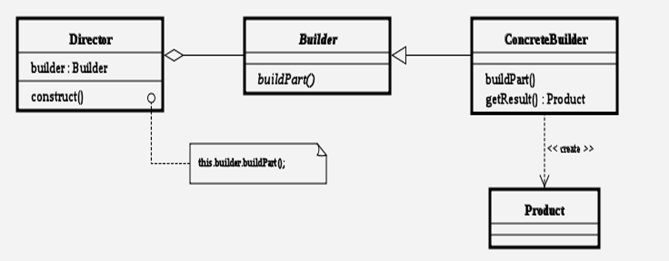

#### 6.3 应用场景

\- 对象的创建：Builder模式是为对象的创建而设计的模式
\- 创建的是一个复合对象：被创建的对象为一个具有复合属性的复合对象
\- 关注对象创建的各部分的创建过程：不同的工厂（这里指builder生成器）对产品属性有不同的创建方法

### 7 装饰模式

#### 7.1 概念

装饰（ Decorator ）模式又叫做包装模式。通过一种对客户端透明的方式来扩展对象的功能，是继承关系的一个替换方案。
装饰模式就是给一个对象增加一些新的功能，而且是动态的，要求装饰对象和被装饰对象实现同一个接口，装饰对象持有被装饰对象的实例 。

#### 7.2 结构


#### 7.3 模式中的角色和职责

抽象组件角色： 一个抽象接口，是被装饰类和装饰类的父接口。
具体组件角色：为抽象组件的实现类。
抽象装饰角色：包含一个组件的引用，并定义了与抽象组件一致的接口。
具体装饰角色：为抽象装饰角色的实现类。负责具体的装饰。

#### 7.4 应用场景

1、需要扩展一个类的功能。
2、动态的为一个对象增加功能，而且还能动态撤销。（继承不能做到这一点，继承的功能是静态的，不能动态增删。）
缺点：产生过多相似的对象，不易排错！ 

### 8 策略模式

#### 8.1 概念

Strategy模式也叫策略模式是行为模式之一，它对一系列的算法加以封装，为所有算法定义一个抽象的算法接口，并通过继承该抽象算法接口对所有的算法加以封装和实现，具体的算法选择交由客户端决定（策略）。Strategy模式主要用来平滑地处理算法的切换 。

#### 8.2 结构


#### 8.3 模式中的角色和职责

Strategy:
​       策略（算法）抽象。

ConcreteStrategy：
​     各种策略（算法）的具体实现。

Context：
​     策略的外部封装类，或者说策略的容器类。根据不同策略执行不同的行为。策略由外部环境决定。 

#### 8.4 优缺点

它的优点有：

1.策略模式提供了管理相关的算法族的办法。策略类的等级结构定义了一个算法或行为族。恰当使用继承可以把公共的代码移到父类里面，从而避免重复的代码。

2.策略模式提供了可以替换继承关系的办法。继承可以处理多种算法或行为。如果不是用策略模式，那么使用算法或行为的环境类就可能会有一些子类，每一个子类提供一个不同的算法或行为。但是，这样一来算法或行为的使用者就和算法或行为本身混在一起。决定使用哪一种算法或采取哪一种行为的逻辑就和算法或行为的逻辑混合在一起，从而不可能再独立演化。继承使得动态改变算法或行为变得不可能。

3.使用策略模式可以避免使用多重条件转移语句。多重转移语句不易维护，它把采取哪一种算法或采取哪一种行为的逻辑与算法或行为的逻辑混合在一起，统统列在一个多重转移语句里面，比使用继承的办法还要原始和落后。

缺点有：

1.客户端必须知道所有的策略类，并自行决定使用哪一个策略类。这就意味着客户端必须理解这些算法的区别，以便适时选择恰当的算法类。换言之，策略模式只适用于客户端知道所有的算法或行为的情况。

2.策略模式造成很多的策略类。有时候可以通过把依赖于环境的状态保存到客户端里面，而将策略类设计成可共享的，这样策略类实例可以被不同客户端使用。换言之，可以使用享元模式来减少对象的数量。

#### 8.5 实例

策略模式定义了一系列算法，并将每个算法封装起来，使他们可以相互替换，且算法的变化不会影响到使用算法的客户。需要设计一个接口，为一系列实现类提供统一的方法，多个实现类实现该接口，设计一个抽象类（可有可无，属于辅助类），提供辅助函数，关系图如下： 

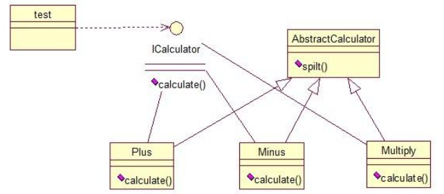

图中 ICalculator 提供同意的方法，AbstractCalculator 是辅助类，提供辅助方法，接下来，依次实现下每个类： 

（1）首先统一接口：

```java
public interface ICalculator {
    public int calculate(String exp);
}
```

（2）辅助类：

```java
public abstract class AbstractCalculator {
    public int[] split(String exp,String opt){
    String array[] = exp.split(opt);
    int arrayInt[] = new int[2];
    arrayInt[0] = Integer.parseInt(array[0]);
    arrayInt[1] = Integer.parseInt(array[1]);
    return arrayInt;
    }
}
```

（3）三个实现类： 

```java
public class Plus extends AbstractCalculator implements ICalculator {
    @Override
    public int calculate(String exp) {
    int arrayInt[] = split(exp,"\\+");
    return arrayInt[0]+arrayInt[1];
    }
}
```

```java
public class Minus extends AbstractCalculator implements ICalculator {
    @Override
    public int calculate(String exp) {
    int arrayInt[] = split(exp,"-");
    return arrayInt[0]-arrayInt[1];
    }
}
```

```java
public class Multiply extends AbstractCalculator implements ICalculator {
    @Override
    public int calculate(String exp) {
    int arrayInt[] = split(exp,"\\*");
    return arrayInt[0]*arrayInt[1];
    }
}
```

（4）简单的测试类： 

```java
public class StrategyTest {
    public static void main(String[] args) {
    String exp = "2+8";
    ICalculator cal = new Plus();
    int result = cal.calculate(exp);
    System.out.println(result);
    }
}
```

输出： 10
策略模式的决定权在用户，系统本身提供不同算法的实现，新增或者删除算法，对各种算法做封装。因此，策略模式多用在算法决策系统中，外部用户只需要决定用哪个算法即可。 

### 9 观察者模式

#### 9.1 概念

Observer模式是行为模式之一，它的作用是当一个对象的状态发生变化时，能够自动通知其他关联对象，自动刷新对象状态。 

Observer模式提供给关联对象一种同步通信的手段，使某个对象与依赖它的其他对象之间保持状态同步。

观察者模式很好理解，类似于邮件订阅和 RSS 订阅，当我们浏览一些博客或 wiki 时，经常会看到 RSS 图标，就这的意思是，当你订阅了该文章，如果后续有更新，会及时通知你。其实，简单来讲就一句话：当一个对象变化时，其它依赖该对象的对象都会收到通知，并且随着变化！对象之间是一种一对多的关系。 

####  9.2 结构


#### 9.3 模式中的角色和职责

Subject（被观察者）
​     被观察的对象。当需要被观察的状态发生变化时，需要通知队列中所有观察者对象。Subject需要维持（添加，删除，通知）一个观察者对象的队列列表。

ConcreteSubject
​     被观察者的具体实现。包含一些基本的属性状态及其他操作。

Observer（观察者）
​     接口或抽象类。当Subject的状态发生变化时，Observer对象将通过一个callback函数得到通知。

ConcreteObserver  
​    观察者的具体实现。得到通知后将完成一些具体的业务逻辑处理。

#### 9.4 典型应用

Observer模式的典型应用

\- 侦听事件驱动程序设计中的外部事件
\- 侦听/监视某个对象的状态变化
\- 发布者/订阅者(publisher/subscriber)模型中，当一个外部事件（新的产品，消息的出现等等）被触发时，通知邮件列表中的订阅者

### 10 享元模式

#### 10.1 概念

Flyweight模式也叫享元模式，是构造型模式之一，它通过与其他类似对象共享数据来减小内存占用。

享元模式的主要目的是实现对象的共享，即共享池，当系统中对象多的时候可以减少内存的开销，通常与工厂模式一起使用。 

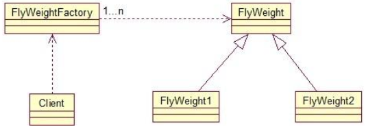

FlyWeightFactory 负责创建和管理享元单元，当一个客户端请求时，工厂需要检查当前对象池中是否有符合条件的对象，如果有，就返回已经存在的对象，如果没有，则创建一个新对象，FlyWeight 是超类。一提到共享池，我们很容易联想到 Java 里面的 JDBC 连接池，想想每个连接的特点，我们不难总结出：适用于作共享的一些个对象，他们有一些共有的属性， 就拿数据库连接池来说，url、driverClassName、username、password 及 dbname，这些属性对于每个连接来说都是一样的，所以就适合用享元模式来处理，建一个工厂类，将上述类似属性作为内部数据，其它的作为外部数据，在方法调用时，当做参数传进来，这样就节省了空间，减少了实例的数量。 

通过连接池的管理，实现了数据库连接的共享，不需要每一次都重新创建连接，节省了数据库重新创建
的开销，提升了系统的性能！ 

#### 10.2 结构


#### 10.3 模式中的角色和职责

抽象享元角色：
​      所有具体享元类的父类，规定一些需要实现的公共接口。

具体享元角色：
​    抽象享元角色的具体实现类，并实现了抽象享元角色规定的方法。

享元工厂角色：
​     负责创建和管理享元角色。

### 11 代理模式

#### 11.1 概念

Proxy模式又叫做代理模式，是构造型的设计模式之一，它可以为其他对象提供一种代理（Proxy）以控制对这个对象的访问。
所谓代理，是指具有与代理元（被代理的对象）具有相同的接口的类，客户端必须通过代理与被代理的目标类交互，而代理一般在交互的过程中（交互前后），进行某些特别的处理。

#### 11.2 结构


#### 11.3 模式中的角色和职责

subject（抽象主题角色）：
​       真实主题与代理主题的共同接口。

RealSubject（真实主题角色）：
​       定义了代理角色所代表的真实对象。 

Proxy（代理主题角色）：
​       含有对真实主题角色的引用，代理角色通常在将客户端调用传递给真是主题对象之前或者之后执行某些操作，而不是单纯返回真实的对象。

#### 11.4 动态代理

1. InvocationHandler 接口
2. invoke方法
3. Proxy.newProxyInstance()

#### 11.5 应用场景

如果已有的方法在使用的时候需要对原有的方法进行改进，此时有两种办法：
1、修改原有的方法来适应。这样违反了“对扩展开放，对修改关闭”的原则。
2、就是采用一个代理类调用原有的方法，且对产生的结果进行控制。这种方法就是代理模式。使用代理模式，可以将功能划分的更加清晰，有助于后期维护！ 

### 12 外观模式

#### 12.1 概念

Facade模式也叫外观模式，是由GoF提出的23种设计模式中的一种。Facade模式为一组具有类似功能的类群，比如类库，子系统等等，提供一个一致的简单的界面。这个一致的简单的界面被称作facade。

外观模式是为了解决类与类之家的依赖关系的，像 spring 一样，可以将类和类之间的关系配置到配置文件中，而外观模式就是将他们的关系放在一个 Facade 类中，降低了类类之间的耦合度，该模式中没有涉及到接口。

#### 12.2 结构


#### 12.3 模式中的角色和职责

Facade
​     为调用方定义简单的调用接口。

Clients
​     调用者。通过Facade接口调用提供某功能的内部类群。

Packages
​     功能提供者。指提供功能的类群（模块或子系统）。

### 13 组合模式

#### 13.1 概念

Composite模式也叫组合模式，是构造型的设计模式之一。通过递归手段来构造树形的对象结构，并可以通过一个对象来访问整个对象树。

组合模式有时又叫部分-整体模式在处理类似树形结构的问题时比较方便。关系图：

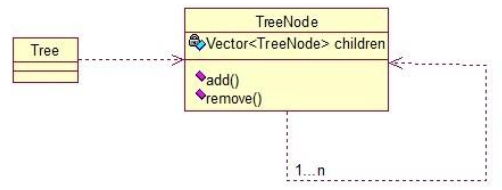

#### 13.2 结构

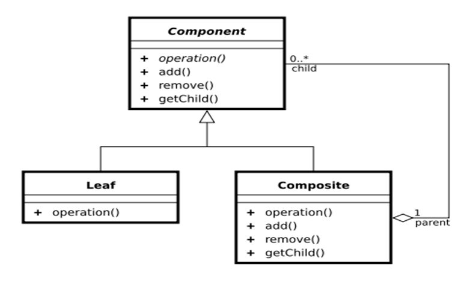

#### 13.3 模式中的角色和规则

Component （树形结构的节点抽象）
\- 为所有的对象定义统一的接口（公共属性，行为等的定义）
\- 提供管理子节点对象的接口方法
\- [可选]提供管理父节点对象的接口方法
Leaf （树形结构的叶节点）
Component的实现子类
Composite（树形结构的枝节点）
Component的实现子类

#### 13.4 应用场景

将多个对象组合在一起进行操作，常用于表示树形结构中，例如二叉树，数等。 

### 14 桥接模式

#### 14.1 概念

Bridge 模式又叫做桥接模式，是构造型的设计模式之一。Bridge模式基于类的最小设计原则，通过使用封装，聚合以及继承等行为来让不同的类承担不同的责任。它的主要特点是把抽象（abstraction）与行为实现（implementation）分离开来，从而可以保持各部分的独立性以及应对它们的功能扩展。

桥接模式就是把事物和其具体实现分开，使他们可以各自独立的变化。桥接的用意是： 将抽象化与实现化解耦，使得二者可以独立变化，像我们常用的 JDBC 桥 DriverManager 一样， JDBC 进行连接数据库的时候，在各个数据库之间进行切换，基本不需要动太多的代码，甚至丝毫不用动，原因就是 JDBC提供统一接口，每个数据库提供各自的实现，用一个叫做数据库驱动的程序来桥接就行了。 关系图： 

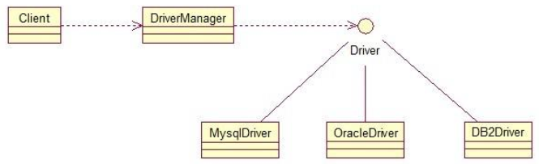

#### 14.2 结构

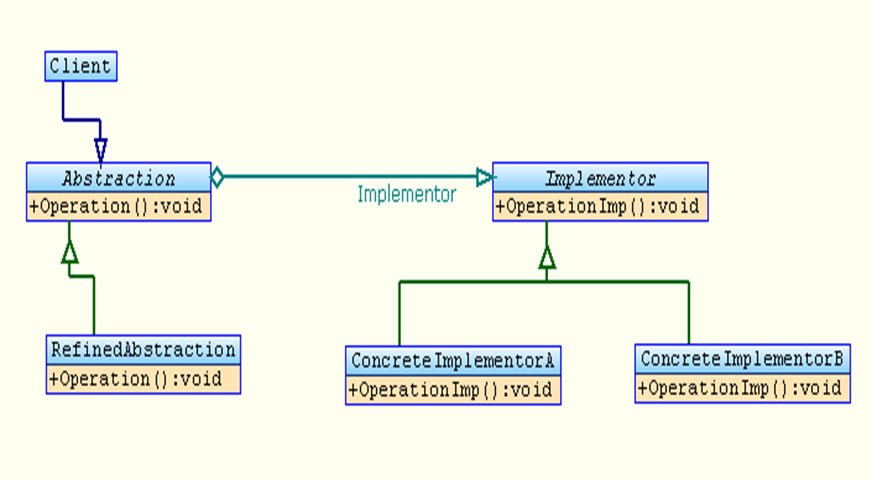

#### 14.3 模式中的角色和职责

Client
​    Bridge模式的使用者

Abstraction
​    抽象类接口（接口或抽象类）
​    维护对行为实现（Implementor）的引用

Refined Abstraction
​    Abstraction子类

Implementor
​    行为实现类接口 (Abstraction接口定义了基于Implementor接口的更高层次的操作)

ConcreteImplementor
​    Implementor子类

### 15 适配器模式

#### 15.1 概念

Adapter模式也叫适配器模式，是构造型模式之一，通过Adapter模式可以改变已有类（或外部类）的接口形式。

#### 15.2 应用场景

在大规模的系统开发过程中，我们常常碰到诸如以下这些情况：我们需要实现某些功能，这些功能已有还不太成熟的一个或多个外部组件，如果我们自己重新开发这些功能会花费大量时间；所以很多情况下会选择先暂时使用外部组件，以后再考虑随时替换。但这样一来，会带来一个问题，随着对外部组件库的替换，可能需要对引用该外部组件的源代码进行大面积的修改，因此也极可能引入新的问题等等。如何最大限度的降低修改面呢？

Adapter模式就是针对这种类似需求而提出来的。

Adapter模式通过定义一个新的接口（对要实现的功能加以抽象），和一个实现该接口的Adapter（适配器）类来透明地调用外部组件。这样替换外部组件时，最多只要修改几个Adapter类就可以了，其他源代码都不会受到影响。

#### 15.3 结构

l1.通过继承实现Adapter

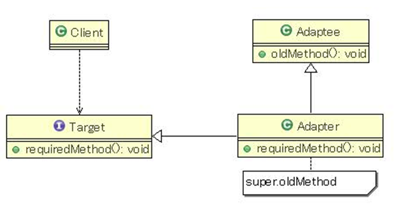

l2.通过委让实现Adapter 

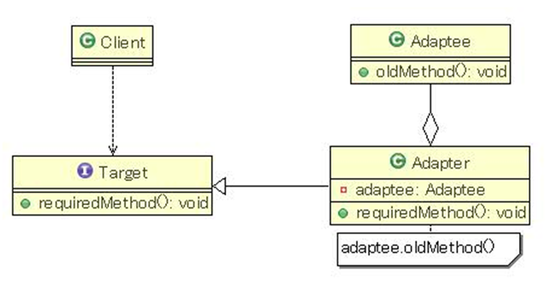

### 16 解释器模式

#### 16.1 概念

Interpreter模式也叫解释器模式，是行为模式之一，它是一种特殊的设计模式，它建立一个解释器，对于特定的计算机程序设计语言，用来解释预先定义的文法。简单地说，Interpreter模式是一种简单的语法解释器构架。

解释器模式用来做各种各样的解释器，如正则表达式等的解释器等等！ 

#### 16.2 应用场景

当有一个语言需要解释执行, 并且你可将该语言中的句子表示为一个抽象语法树时，可使用解释器模式。而当存在以下情况时该模式效果最好： 

该文法简单对于复杂的文法, 文法的类层次变得庞大而无法管理。此时语法分析程序生成器这样的工具是更好的选择。它们无需构建抽象语法树即可解释表达式, 这样可以节省空间而且还可能节省时间。 

效率不是一个关键问题，最高效的解释器通常不是通过直接解释语法分析树实现的, 而是首先将它们转换成另一种形式。例如，正则表达式通常被转换成状态机。但即使在这种情况下, 转换器仍可用解释器模式实现, 该模式仍是有用的。

#### 16.3 结构

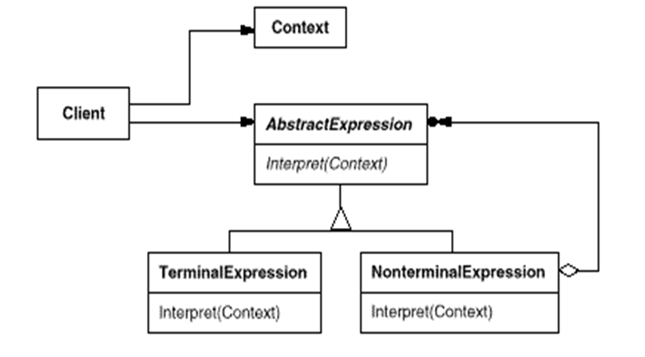

#### 16.4 模式中的角色和职责

Context
​     解释器上下文环境类。用来存储解释器的上下文环境，比如需要解释的文法等。

AbstractExpression
​     解释器抽象类。

ConcreteExpression
​     解释器具体实现类。 

### 17 中介者模式

#### 17.1 概念

Mediator模式也叫中介者模式，是由GoF提出的23种软件设计模式的一种。Mediator模式是行为模式之一，在Mediator模式中，类之间的交互行为被统一放在Mediator的对象中，对象通过Mediator对象同其他对象交互，Mediator对象起着控制器的作用。

中介者模式也是用来降低类类之间的耦合的，因为如果类类之间有依赖关系的话，不利于功能的拓展和维护，因为只要修改一个对象，其它关联的对象都得进行修改。如果使用中介者模式，只需关心和Mediator 类的关系，具体类类之间的关系及调度交给 Mediator 就行，这有点像 spring 容器的作用。 

#### 17.2 结构

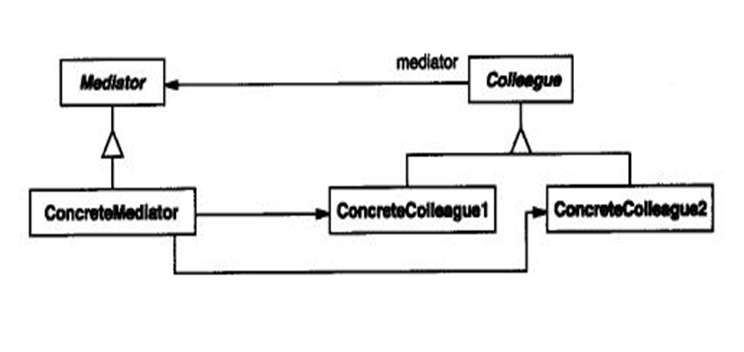

#### 17.3 模式中的角色和职责

mediator
​    中介者类的抽象父类。

concreteMediator
​    具体的中介者类。

colleague
  关联类的抽象父类。

concreteColleague
  具体的关联类。

#### 17.4 优点

1，将系统按功能分割成更小的对象，符合类的最小设计原则
2，对关联对象的集中控制
3，减小类的耦合程度，明确类之间的相互关系：当类之间的关系过于复杂时，其中任何一个类的修改都会影响到其他类，不符合类的设计的开闭原则，而Mediator模式将原来相互依存的多对多的类之间的关系简化为Mediator控制类与其他关联类的一对多的关系，当其中一个类修改时，可以对其他关联类不产生影响（即使有修改，也集中在Mediator控制类）
4，有利于提高类的重用性

### 18 职责链模式

#### 18.1 概念

Chain of Responsibility（CoR）模式也叫职责链模式或者职责连锁模式，是行为模式之一，该模式构造一系列分别担当不同的职责的类的对象来共同完成一个任务，这些类的对象之间像链条一样紧密相连，所以被称作职责链模式。

有多个对象，每个对象持有对下一个对象的引用，这样就会形成一条链，请求在这条链上传递，直到某一对象决定处理该请求。但是发出者并不清楚到底最终那个对象会处理该请求，所以，职责链模式可以实现，在隐瞒客户端的情况下，对系统进行动态的调整。 

#### 18.2 应用场景

例1：比如客户Client要完成一个任务，这个任务包括a,b,c,d四个部分。
 首先客户Client把任务交给A，A完成a部分之后，把任务交给B，B完成b部分，...，直到D完成d部分。
例2：比如政府部分的某项工作，县政府先完成自己能处理的部分，不能处理的部分交给省政府，省政府再完成自己职责范围内的部分，不能处理的部分交给中央政府，中央政府最后完成该项工作。
例3：软件窗口的消息传播。
例4：SERVLET容器的过滤器（Filter）框架实现。

#### 18.3 基本条件

要实现Chain of Responsibility模式，需要满足该模式的基本条件：
1，对象链的组织。需要将某任务的所有职责执行对象以链的形式加以组织。 
2，消息或请求的传递。将消息或请求沿着对象链传递，以让处于对象链中的对象得到处理机会。
3，处于对象链中的对象的职责分配。不同的对象完成不同的职责。
4，任务的完成。处于对象链的末尾的对象结束任务并停止消息或请求的继续传递。 

#### 18.4 结构

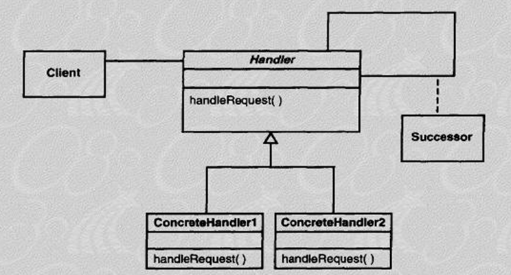

#### 18.5 模式中的角色和职责

Handler 
​    处理类的抽象父类。

concreteHandler 
​    具体的处理类。

#### 18.6 优缺点

优点：
1.责任的分担。每个类只需要处理自己该处理的工作（不该处理的传递给下一个对象完成），明确各类的责任范围，符合类的最小封装原则。
2.可以根据需要自由组合工作流程。如工作流程发生变化，可以通过重新分配对象链便可适应新的工作流程。
3.类与类之间可以以松耦合的形式加以组织。

缺点：
因为处理时以链的形式在对象间传递消息，根据实现方式不同，有可能会影响处理的速度。

### 19 迭代模式

#### 19.1 概念

Iterator模式也叫迭代模式，是行为模式之一，它把对容器中包含的内部对象的访问委让给外部类，使用Iterator（遍历）按顺序进行遍历访问的设计模式。

迭代器模式就是顺序访问聚集中的对象，一般来说，集合中非常常见 。这句话包含两层意思：一是需要遍历的对象，即聚集对象，二是迭代器对象，用于对聚集对象进行遍历访问。 

#### 19.2 不使用迭代模式的应用

在应用Iterator模式之前，首先应该明白Iterator模式用来解决什么问题。或者说，如果不使用Iterator模式，会存在什么问题。
1.由容器自己实现顺序遍历。直接在容器类里直接添加顺序遍历方法。
2.让调用者自己实现遍历。直接暴露数据细节给外部。

#### 19.3 不使用迭代模式的缺点

以上方法1与方法2都可以实现对遍历，这样有问题呢？

1，容器类承担了太多功能：一方面需要提供添加删除等本身应有的功能；一方面还需要提供遍历访问功能。
2，往往容器在实现遍历的过程中，需要保存遍历状态，当跟元素的添加删除等功能夹杂在一起，很容易引起混乱和程序运行错误等。

#### 19.4 使用迭代模式的应用

Iterator模式就是为了有效地处理按顺序进行遍历访问的一种设计模式，简单地说，Iterator模式提供一种有效的方法，可以屏蔽聚集对象集合的容器类的实现细节，而能对容器内包含的对象元素按顺序进行有效的遍历访问。 

所以，Iterator模式的应用场景可以归纳为满足以下几个条件：
 \- 访问容器中包含的内部对象
 \- 按顺序访问

#### 19.5 结构


#### 19.6 模式中的角色和职责

Iterator（迭代器接口）：
该接口必须定义实现迭代功能的最小定义方法集
比如提供hasNext()和next()方法。

ConcreteIterator（迭代器实现类）：
迭代器接口Iterator的实现类。可以根据具体情况加以实现。

Aggregate（容器接口）：
定义基本功能以及提供类似Iterator iterator()的方法。

concreteAggregate（容器实现类）：
容器接口的实现类。必须实现Iterator iterator()方法。 

#### 19.7 优点

1，实现功能分离，简化容器接口。让容器只实现本身的基本功能，把迭代功能委让给外部类实现，符合类的设计原则。
2，隐藏容器的实现细节。
3，为容器或其子容器提供了一个统一接口，一方面方便调用；另一方面使得调用者不必关注迭代器的实现细节。
4，可以为容器或其子容器实现不同的迭代方法或多个迭代方法。 

### 20 模板方法模式

#### 20.1 概念

Template Method模式也叫模板方法模式，是行为模式之一，它把具有特定步骤算法中的某些必要的处理委让给抽象方法，通过子类继承对抽象方法的不同实现改变整个算法的行为。

#### 20.2 应用场景

Template Method模式一般应用在具有以下条件的应用中：
\- 具有统一的操作步骤或操作过程
\- 具有不同的操作细节
\- 存在多个具有同样操作步骤的应用场景，但某些具体的操作细节却各不相同

#### 20.3 结构


#### 20.4 模式中的角色和职责

AbstractClass：
抽象类的父类

ConcreteClass：
具体的实现子类

templateMethod()：
模板方法

method1()与method2()：
具体步骤方法  

#### 20.5 实例

一个抽象类中，有一个主方法，再定义 1...n 个方法，可以是抽象的，也可以是实际的方法，定义一个类，继承该抽象类，重写抽象方法，通过调用抽象类，实现对子类的调用，先看个关系图： 

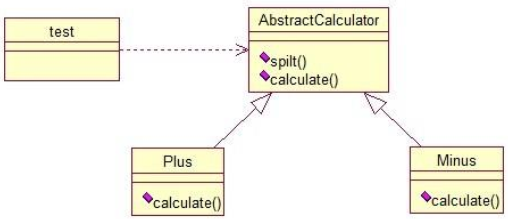

就是在 AbstractCalculator 类中定义一个主方法 calculate， calculate()调用 spilt()等， Plus 和 Minus 分别继承 AbstractCalculator 类，通过对 AbstractCalculator 的调用实现对子类的调用，看下面的例子：

```java
public abstract class AbstractCalculator {
    /*主方法，实现对本类其它方法的调用*/
    public final int calculate(String exp,String opt){
    int array[] = split(exp,opt);
    return calculate(array[0],array[1]);
    }
    /*被子类重写的方法*/
    abstract public int calculate(int num1,int num2);
    public int[] split(String exp,String opt){
    String array[] = exp.split(opt);
    int arrayInt[] = new int[2];
    arrayInt[0] = Integer.parseInt(array[0]);
    arrayInt[1] = Integer.parseInt(array[1]);
    return arrayInt;
    }
}
```

```java
public class Plus extends AbstractCalculator {
    @Override
    public int calculate(int num1,int num2) {
    return num1 + num2;
    }
}
```

```java
public class StrategyTest {
    public static void main(String[] args) {
    String exp = "8+8";
    AbstractCalculator cal = new Plus();
    int result = cal.calculate(exp, "\\+");
    System.out.println(result);
    }
}
```

思路：首先将 exp 和"\\+"做参数，调用 AbstractCalculator 类里的calculate(String,String)方法，在 calculate(String,String)里调用同类的 split()，之后再调用calculate(int ,int)方法，从这个方法进入到子类中，执行完 return num1 + num2 后，将值返回到AbstractCalculator 类，赋给 result，打印出来。 

### 21 备忘录模式

#### 21.1 概念

Memento模式也叫备忘录模式，是行为模式之一，它的作用是保存对象的内部状态，并在需要的时候（undo/rollback）恢复对象以前的状态。

#### 21.2 结构

主要目的是保存一个对象的某个状态， 以便在适当的时候恢复对象，个人觉得叫备份模式更形象些，通俗的讲下：假设有原始类 A， A 中有各种属性， A 可以决定需要备份的属性，备忘录类 B 是用来存储 A 的一些内部状态，类 C 呢，就是一个用来存储备忘录的，且只能存储，不能修改等操作。 

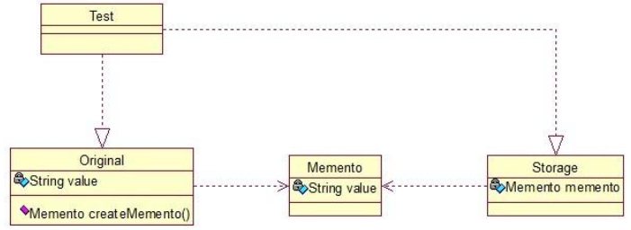

#### 21.3 模式中的角色和职责

Originator（原生者）
​    需要被保存状态以便恢复的那个对象。

Memento（备忘录）
​    该对象由Originator创建，主要用来保存Originator的内部状态。

Caretaker（管理者）
​    负责在适当的时间保存/恢复Originator对象的状态。

#### 21.4 应用场景

如果一个对象需要保存状态并可通过undo或rollback等操作恢复到以前的状态时，可以使用Memento模式。
 1）一个类需要保存它的对象的状态（相当于Originator角色）
 2）设计一个类，该类只是用来保存上述对象的状态（相当于Memento角色）
 3）需要的时候，Caretaker角色要求Originator返回一个Memento并加以保存
 4）undo或rollback操作时，通过Caretaker保存的Memento恢复Originator对象的状态

### 22 状态模式

#### 22.1 概念

State模式也叫状态模式，是行为设计模式的一种。State模式允许通过改变对象的内部状态而改变对象的行为，这个对象表现得就好像修改了它的类一样。 

核心思想就是：当对象的状态改变时，同时改变其行为 。就拿 QQ 来说，有几种状态，在线、隐身、忙碌等，每个状态对应不同的操作，而且你的好友也能看到你的状态，所以，状态模式就两点：①可以通过改变状态来获得不同的行为。②你的好友能同时看到你的变化。 

#### 22.2 结构

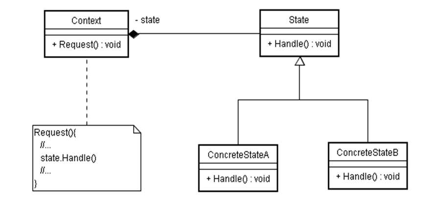

#### 22.3 模式中的角色和职责

Context：用户对象
拥有一个State类型的成员，以标识对象的当前状态； 

State：接口或基类
封装与Context的特定状态相关的行为； 

ConcreteState：接口实现类或子类
实现了一个与Context某个状态相关的行为。 

#### 22.4 应用场景

状态模式主要解决的是当控制一个对象状态转换的条件表达式过于复杂时的情况。把状态的判断逻辑转译到表现不同状态的一系列类当中，可以把复杂的判断逻辑简化。

状态模式在日常开发中用的挺多的，尤其是做网站的时候，我们有时希望根据对象的某一属性，区别开他们的一些功能，比如说简单的权限控制等。 

### 23 命令模式

#### 23.1 概念

Command模式也叫命令模式 ，是行为设计模式的一种。Command模式通过被称为Command的类封装了对目标对象的调用行为以及调用参数。

命令模式很好理解，举个例子，司令员下令让士兵去干件事情，从整个事情的角度来考虑，司令员的作用是，发出口令，口令经过传递，传到了士兵耳朵里，士兵去执行。这个过程好在，三者相互解耦，任何一方都不用去依赖其他人，只需要做好自己的事儿就行，司令员要的是结果，不会去关注到底士兵是怎么实现的。 

#### 23.2 结构

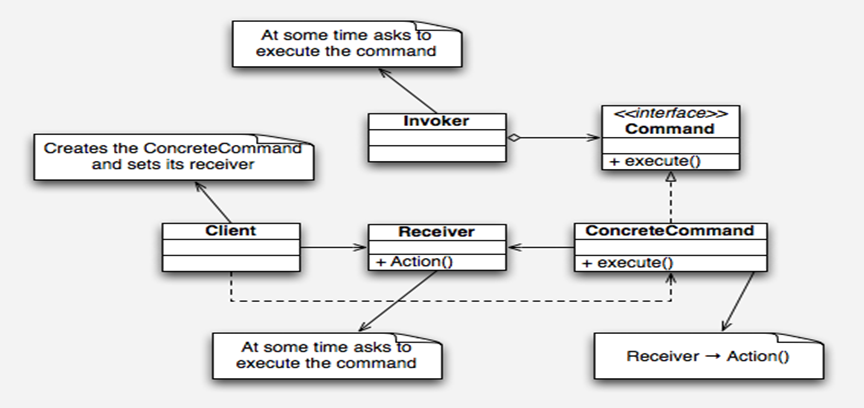

#### 23.3 模式中的角色和职责

Command
​     Command抽象类。

ConcreteCommand
​     Command的具体实现类。

Receiver
​     需要被调用的目标对象。

Invorker
​     通过Invorker执行Command对象。

#### 23.4 应用场景

在面向对象的程序设计中，一个对象调用另一个对象，一般情况下的调用过程是：创建目标对象实例；设置调用参数；调用目标对象的方法。

但在有些情况下有必要使用一个专门的类对这种调用过程加以封装，我们把这种专门的类称作command类。
 \- 整个调用过程比较繁杂，或者存在多处这种调用。

这时，使用Command类对该调用加以封装，便于功能的再利用。
 \- 调用前后需要对调用参数进行某些处理。
 \- 调用前后需要进行某些额外处理，比如日志，缓存，记录历史操作等。 

命令模式的目的就是达到命令的发出者和执行者之间解耦，实现请求和执行分开，熟悉Struts的同学应该知道，Struts其实就是一种将请求和呈现分离的技术，其中必然涉及命令模式的思想！ 

### 24 访问者模式

#### 24.1 概念

Visitor模式也叫访问者模式，是行为模式之一，它分离对象的数据和行为，使用Visitor模式，可以不修改已有类的情况下，增加新的操作。

访问者模式把数据结构和作用于结构上的操作解耦合，使得操作集合可相对自由地演化。访问者模式适用于数据结构相对稳定算法又易变化的系统。因为访问者模式使得算法操作增加变得容易。若系统数据结构对象易于变化，经常有新的数据对象增加进来，则不适合使用访问者模式。访问者模式的优点是增加操作很容易，因为增加操作意味着增加新的访问者。访问者模式将有关行为集中到一个访问者对象中，其改变不影响系统数据结构。其缺点就是增加新的数据结构很困难。  

简单来说，访问者模式就是一种分离对象数据结构与行为的方法，通过这种分离，可达到为一个被访问者动态添加新的操作而无需做其它的修改的效果。 

#### 24.2 结构


#### 24.3 模式中的角色和职责

1) 访问者角色（Visitor）：
​     为该对象结构中具体元素角色声明一个访问操作接口。该操作接口的名字和参数标识了发送访问请求给具体访问者的具体元素角色。这样访问者就可以通过该元素角色的特定接口直接访问它。 

2) 具体访问者角色（Concrete Visitor）：
​     实现每个由访问者角色（Visitor）声明的操作。 

3) 元素角色（Element）：
​      定义一个Accept操作，它以一个访问者为参数。 

4) 具体元素角色（Concrete Element）：
​     实现由元素角色提供的Accept操作。 

5) 对象结构角色（Object Structure）：
​      这是使用访问者模式必备的角色。它要具备以下特征：能枚举它的元素；可以提供一个高层的接口以允许该访问者访问它的元素；可以是一个复合（组合模式）或是一个集合，如一个列表或一个无序集合。

#### 24.4 应用场景

如果我们想为一个现有的类增加新功能，不得不考虑几个事情：（1）新功能会不会与现有功能出现兼容性问题？ （2）以后会不会再需要添加？ （3）如果类不允许修改代码怎么办？面对这些问题，最好的解决方法就是使用访问者模式，访问者模式适用于数据结构相对稳定的系统，把数据结构和算法解耦。

比如有一个公园，有一到多个不同的组成部分；该公园存在多个访问者：清洁工A负责打扫公园的A部分，清洁工B负责打扫公园的B部分，公园的管理者负责检点各项事务是否完成，上级领导可以视察公园等等。也就是说，对于同一个公园，不同的访问者有不同的行为操作，而且访问者的种类也可能需要根据时间的推移而变化（行为的扩展性）。 


## 第四章  设计模式图

### 1 UML类图

#### 1.1 抽象类的类图

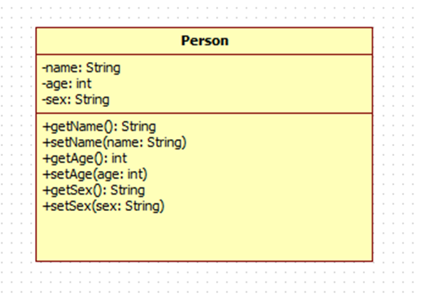

#### 1.2 抽象类


#### 1.3 接口

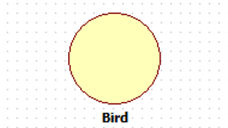

#### 1.4 对象

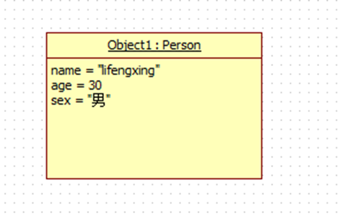

#### 1.5 一般化关系（继承）

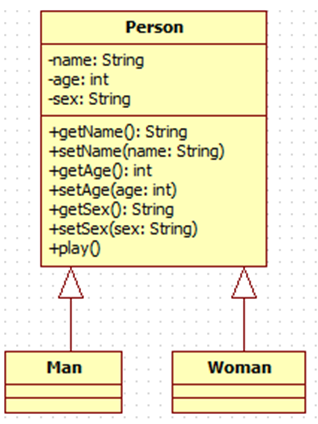

#### 1.6 关联关系

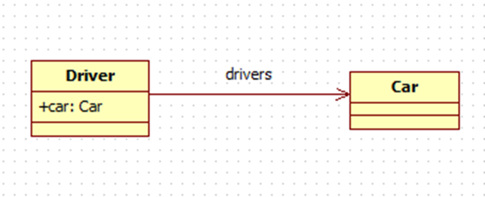

#### 1.7 关联基数

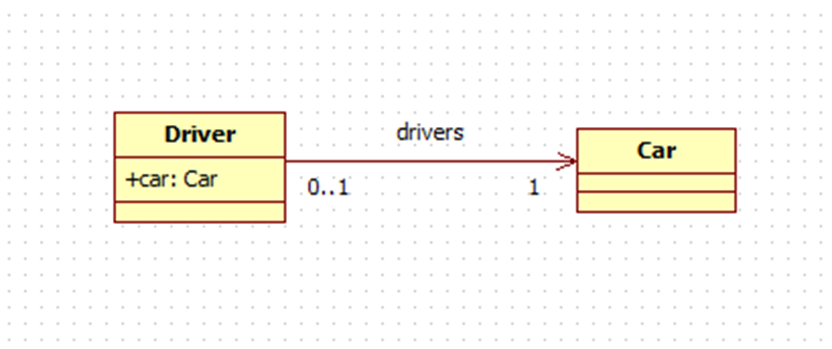

#### 1.8 聚合关系

聚合关系是关联关系的一种，表示的是整体和个体之间的关系。

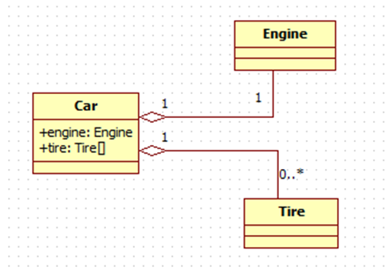

#### 1.9 合成关系

合成关系是关联关系的一种，比聚合关系更强，它要求普通的聚合关系中代表整体的对象负责代表部分的对象的生命周期，合成关系不能共享。

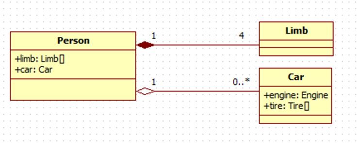

#### 1.10 依赖关系

依赖也是类与类之间的连接，依赖总是单向的。依赖关系表示一个类依赖于另一个类的定义。

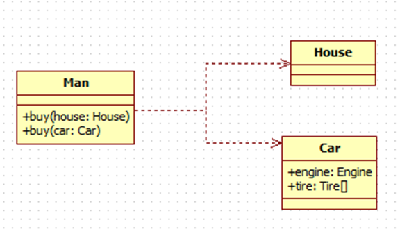